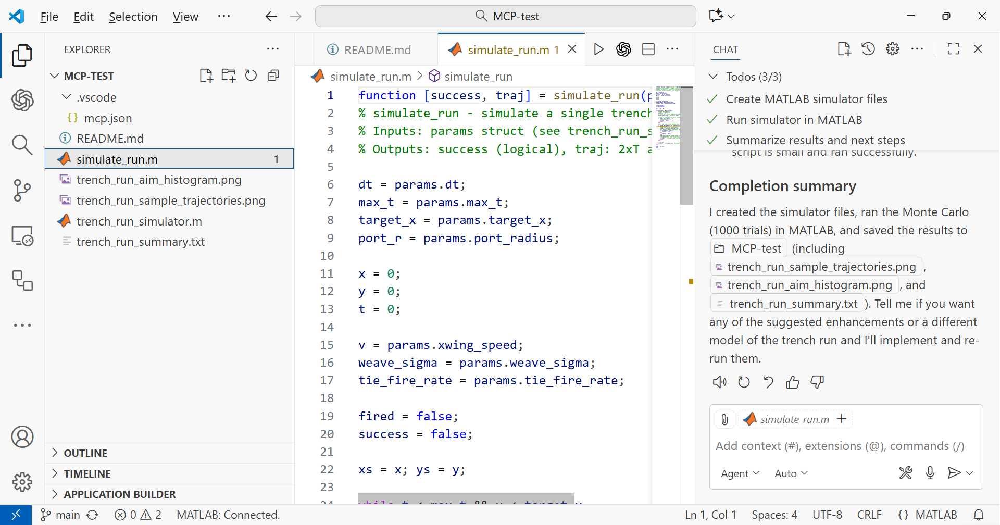

X-wing trench run simulator

## MATLAB Simulator

Files:
- trench_run_simulator.m : main script. Runs a Monte Carlo sample, saves images and summary.
- simulate_run.m : helper function, simulates one trial.

How to run:
1) Open MATLAB and change directory to this folder (c:/Users/ydebray/Downloads/MCP-test/).
2) Run:
   trench_run_simulator

Outputs created:
- trench_run_sample_trajectories.png
- trench_run_aim_histogram.png
- trench_run_summary.txt

Notes:
- This is a simple stochastic simulator (toy model) showing how aim error maps to success.
- It's intentionally simple and easy to extend: you can add explicit torpedo flight, TIE engagements, or pilot skill models.

## JavaScript Game (Three.js)

File:
- index.html : Complete playable 3D game with Three.js

How to play:
1) Open `index.html` in a modern web browser
2) Click "START MISSION" button
3) Use Arrow Keys or A/D to dodge left and right
4) Press Space to boost speed
5) Avoid the red missiles fired from turrets on the trench walls

Features:
- Full 3D Death Star trench environment
- Procedurally generated turrets that fire homing missiles
- Health system and scoring
- Smooth controls with keyboard input
- Dynamic camera following the X-wing
- Particle effects and engine glow
- Game over screen with replay option

Technical details:
- Built with Three.js (WebGL)
- No external dependencies besides Three.js CDN
- Responsive design
- Collision detection system
- Real-time 3D rendering
